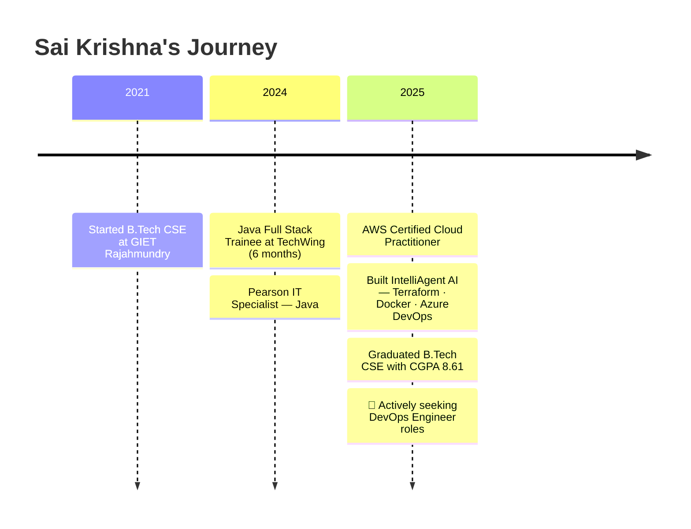

<!-- ============================================================ -->
<!--  SAI KRISHNA KASIMALLA — GITHUB PROFILE README  v3.0        -->
<!-- ============================================================ -->

<div align="center">


</div>

<br>

<div align="center">

<a href="https://linkedin.com/in/sai-krishna-kasimalla-126b67252">
  
</a>
&nbsp;
<a href="https://leetcode.com/Sai_krishna-123">
  
</a>
&nbsp;
<a href="mailto:saikrishnakasimalla@gmail.com">
  
</a>
&nbsp;


</div>

<br>

---

## `$ whoami`

```yaml
name    : Sai Krishna Kasimalla
degree  : B.Tech Computer Science — GIET Rajahmundry (2025) · CGPA 8.61
location: Hyderabad, India
focus   : DevOps Engineer  →  automate everything between code and production
also    : Java Full Stack · Backend · Cloud Engineering
status  : 🟢 Open to full-time fresher roles — available immediately
```

> *"If it can be scripted, it should never be manual."*

---

## 🗺 Career Timeline



---

## ⚙️ Tech Stack

<div align="center">

| Domain | Tools |
|---|---|
| **Languages** | Java · Python · JavaScript · Bash |
| **Cloud & IaC** | AWS · Azure · Terraform · Ansible |
| **CI/CD & Containers** | GitHub Actions · Azure DevOps · Docker · Jenkins |
| **Backend** | Spring Boot · Spring Security · REST APIs · JWT |
| **Frontend** | React.js · HTML/CSS |
| **Data** | MySQL · MongoDB · Redis |
| **Observability** | Grafana · Prometheus |

</div>

---

## 🚀 Projects

### 🤖 IntelliAgent AI / NeuralOps &nbsp;·&nbsp; *Cloud-Native IaC Pipeline*
> **Terraform · Docker · GitHub Actions · Azure DevOps · Microsoft Azure**

Built a fully automated cloud provisioning platform where modular Terraform configs deploy Azure infrastructure end-to-end — no manual console clicks. Docker packages the application; GitHub Actions and Azure DevOps handle build → test → deploy → release on every push. The result: repeatable, version-controlled infra with a self-healing pipeline.

**What it solves:** Manual cloud provisioning is slow, inconsistent, and a liability at scale. This eliminates that entirely.

---

### 🏥 AI MediSync &nbsp;·&nbsp; *Healthcare Platform (In Progress)*
> **Spring Boot Microservices · React.js · MySQL · JWT · Spring AI**

A full microservices healthcare system featuring prescription OCR/AI extraction, medicine reminders, appointment scheduling, and a Doctor Dashboard. Built on an API Gateway + Eureka Service Discovery architecture with event-driven communication between services.

**Architecture:** Patient Service · Doctor Service · Appointment Service · Notification Service — each independently deployable.

---

### 🏦 Vault &nbsp;·&nbsp; *Full-Stack Banking Platform*
> **Java · Spring Boot · React.js · MySQL**

A secure banking application with JWT authentication, a full transaction ledger, role-based access control, and a clean REST API backend wired to a responsive React front end.

---

### 🔗 Blockchain Product Verification System &nbsp;·&nbsp; *Final Year Capstone*
> **Blockchain · Java · React · Team Lead (4 members)**

Led a 4-person team to build a product authenticity verification system using smart-contract logic and a React dashboard. Managed end-to-end: system design, smart contracts, and delivery.

---

## 🏆 Certifications

<div align="center">

| Certification | Issuer | Status |
|---|---|---|
| ☁️ **AWS Certified Cloud Practitioner** | Amazon Web Services | 🟢 Active |
| ☕ **IT Specialist: Java** | Pearson / Certiport | 🟢 Active |

</div>

---

## ⚡ Competitive Programming &nbsp;·&nbsp; 500+ Solves

<div align="center">


<br>

<a href="https://www.hackerrank.com/saikrishnakasim1">
  
</a>
&nbsp;
<a href="https://www.codechef.com/users/saikrishnak_45">
  
</a>
&nbsp;
<a href="https://auth.geeksforgeeks.org/user/saikrishna9xc3">
  
</a>

</div>

---

## 📊 GitHub Stats

<div align="center">


<br>


</div>

---

## 🐍 Contribution Activity

<div align="center">
<picture>
  <source media="(prefers-color-scheme: dark)" srcset="https://raw.githubusercontent.com/SaiKrishnaKasimalla-839/SaiKrishnaKasimalla-839/output/github-snake-dark.svg" />
  <source media="(prefers-color-scheme: light)" srcset="https://raw.githubusercontent.com/SaiKrishnaKasimalla-839/SaiKrishnaKasimalla-839/output/github-snake.svg" />
  
</picture>
</div>

---

## 🎯 Currently

```diff
+ Applying   : DevOps Engineer — fresher roles across India
+ Building   : AI MediSync — healthcare microservices platform
+ Learning   : Kubernetes · Advanced Terraform modules · DevSecOps
+ Side Quest : Telugu YouTube series on the fresher job hunt
```

---

<div align="center">

**Open to full-time fresher roles · DevOps · Cloud · Java Full Stack**

<br>

<a href="https://linkedin.com/in/sai-krishna-kasimalla-126b67252">
  
</a>
&nbsp;
<a href="mailto:saikrishnakasimalla@gmail.com">
  
</a>

<br><br>


</div>
