<div align="center">


<a href="https://git.io/typing-svg">
  
</a>

<br/>


</div>

<br/>

<!-- ============ TERMINAL ABOUT ============ -->
<table align="center" width="100%">
<tr><td>

```bash
sai@devops:~$ whoami --verbose
```
```yaml
name        : Sai Krishna Kasimalla
role        : DevOps Engineer | Cloud (Azure/AWS) | Java Full Stack
education   : B.Tech CSE, GIET Rajahmundry — CGPA 8.61 (2025)
location    : Hyderabad, India 🇮🇳
core_stack  : Terraform · Docker · GitHub Actions · Azure DevOps · Azure
certs       : ["AWS Certified Cloud Practitioner", "IT Specialist: Java (Pearson)"]
dsa         : 500+ problems solved across LeetCode/HackerRank/CodeChef/GFG
mindset     : "Automate it, containerize it, monitor it, ship it."
status      : Actively interviewing — fresher / entry-level roles
```

</td></tr>
</table>

---

## ⚙️ CI/CD Pipeline — My Career So Far

```mermaid
flowchart LR
    A[🎓 B.Tech CSE\nGIET 2025] -->|build| B[💼 TechWing\nJava Full Stack Trainee]
    B -->|test| C[☁️ AWS Cloud\nPractitioner Cert]
    C -->|package| D[🏆 IT Specialist\nJava Cert]
    D -->|deploy| E[🚀 IntelliAgent AI\nTerraform · Docker · Azure]
    E -->|monitor| F[🎯 DevOps Engineer\nOpen to Work]

    style A fill:#1a0533,stroke:#22D3EE,color:#fff
    style B fill:#1a0533,stroke:#22D3EE,color:#fff
    style C fill:#1a0533,stroke:#22D3EE,color:#fff
    style D fill:#1a0533,stroke:#22D3EE,color:#fff
    style E fill:#302b63,stroke:#A855F7,color:#fff
    style F fill:#0f0c29,stroke:#22c55e,color:#fff
```



---

## 🧰 Tech Arsenal

<div align="center">

**Languages**


**Cloud & IaC — Core Differentiator**


**CI/CD & Containers**


**Full Stack**


**Observability & Data**


</div>

---

## 🏆 Certifications

<div align="center">

| Certification | Issuer | Status |
|:---|:---|:---:|
| ☁️ **AWS Certified Cloud Practitioner** | Amazon Web Services | ✅ |
| ☕ **IT Specialist: Java** | Pearson / Certiport | ✅ |

</div>

---

## 🔥 Featured Projects

<details open>
<summary><b>🤖 IntelliAgent AI</b> — Cloud-native infra automation</summary>
<br/>

`Terraform` `Docker` `GitHub Actions` `Azure DevOps` `Microsoft Azure`

Infrastructure-as-Code driven deployment pipeline — provisions Azure resources with Terraform, containerizes with Docker, and ships through automated GitHub Actions / Azure DevOps pipelines.
</details>

<details>
<summary><b>🏦 Vault</b> — Full-stack banking platform</summary>
<br/>

`Java` `Spring Boot` `React.js` `MySQL`

Secure banking application with JWT-based auth, transaction management, and a React front end backed by a Spring Boot REST API.
</details>

<details>
<summary><b>🎓 MediNova AI / Virtual Classroom</b> — LLM-powered learning</summary>
<br/>

`Spring Boot` `Spring AI` `Ollama (DeepSeek)` `MongoDB`

AI-assisted virtual classroom integrating a locally-hosted DeepSeek model via Spring AI for intelligent tutoring and content generation.
</details>

<details>
<summary><b>🔗 Blockchain Product Verification System</b> — Final-year capstone</summary>
<br/>

`Blockchain` `Java` `React`

Decentralized product authentication system; led a team of 4 from design through deployment.
</details>

---

## 📊 GitHub Stats

<div align="center">


<br/><br/>


</div>

---

## ⚡ DSA Journey — 500+ Problems Solved

<div align="center">


[](https://www.hackerrank.com/saikrishnakasim1)
[](https://www.codechef.com/users/saikrishnak_45)
[](https://auth.geeksforgeeks.org/user/saikrishna9xc3)

</div>

---

## 📈 Contribution Graph

<div align="center">

</div>

## 🐍 Contribution Snake

<div align="center">
<picture>
  <source media="(prefers-color-scheme: dark)" srcset="https://raw.githubusercontent.com/SaiKrishnaKasimalla-839/SaiKrishnaKasimalla-839/output/github-snake-dark.svg" />
  <source media="(prefers-color-scheme: light)" srcset="https://raw.githubusercontent.com/SaiKrishnaKasimalla-839/SaiKrishnaKasimalla-839/output/github-snake.svg" />
  
</picture>

<sub>Setup: add `.github/workflows/snake.yml` using the `Platane/snk` action.</sub>
</div>

---

## 🎯 Currently

```yaml
applying_to : DevOps Engineer (fresher) roles — primary focus
secondary   : Java Full Stack · Backend · Software Engineer
shipping    : Portfolio site + interactive terminal component (React)
sharpening  : Kubernetes · advanced Terraform modules · DevSecOps
side_quest  : Exploring a Telugu-language YT channel on the job-hunt journey
```

---

## 🌐 Connect

<div align="center">

[](https://linkedin.com/in/sai-krishna-kasimalla-126b67252)
[](https://github.com/SaiKrishnaKasimalla-839)
[](https://leetcode.com/Sai_krishna-123)
[](mailto:saikrishnakasimalla@gmail.com)

**⚡ Open to full-time fresher roles — DevOps · Cloud · Java Full Stack**

*"Provision it. Containerize it. Automate the rest."*


</div>
