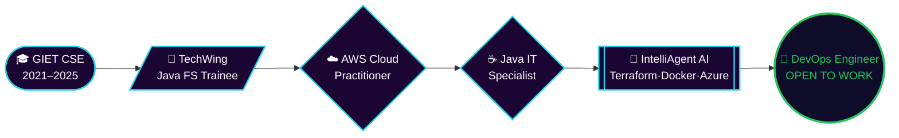

<!-- ============================================================ -->
<!--  SAI KRISHNA KASIMALLA — GITHUB PROFILE README               -->
<!-- ============================================================ -->

<div align="center">


<br>


<a href="https://linkedin.com/in/sai-krishna-kasimalla-126b67252"></a>

</div>

<br>

<!-- ============== SPLIT: TERMINAL + INFO CARD ============== -->
<table align="center">
<tr>
<td width="55%" valign="top">

```bash
guest@portfolio:~$ ./init_sai_krishna.sh

[1/6] Loading identity..................... done
[2/6] Mounting education...................... done
[3/6] Provisioning cloud certs.............. done
[4/6] Spinning up core projects.......... done
[5/6] Indexing 500+ DSA solves............. done
[6/6] Setting status = OPEN_TO_WORK......... done

>> whoami
Sai Krishna Kasimalla
B.Tech CSE, GIET Rajahmundry (2025) · CGPA 8.61
Hyderabad, India 🇮🇳

>> target_role
"DevOps Engineer" (primary)
"Java Full Stack / Backend / SWE" (secondary)

>> philosophy
"If it can be scripted, it shouldn't be manual."
```

</td>
<td width="45%" valign="top">

### 🪪 Quick Facts

| | |
|---|---|
| 🎓 | B.Tech CSE — GIET, 2025 |
| 📍 | Hyderabad, India |
| ☁️ | AWS Certified Cloud Practitioner |
| ☕ | Pearson IT Specialist: Java |
| 🧪 | Ex-Trainee, TechWing (Java Full Stack) |
| ⚡ | 500+ DSA problems solved |
| 🎯 | Hunting: DevOps Engineer roles |
| 🟢 | Available immediately |

### 🛠️ This Year I'm Shipping

- Modular **Terraform** infra blueprints
- Multi-stage **Docker** + Azure DevOps pipelines
- A self-hosted, no-third-party-dependency portfolio
- A Telugu-language YouTube series on the fresher job hunt

</td>
</tr>
</table>

---

## 🗺️ Career Pipeline

<div align="center">



</div>

---

## ⚙️ Stack — grouped by what it's *for*, not just what it is

<table align="center" width="100%">
<tr>
<td align="center" width="20%"><b>🧠 Languages</b><br><br>

</td>
<td align="center" width="20%"><b>☁️ Cloud & IaC</b><br><br>

</td>
<td align="center" width="20%"><b>🔁 CI/CD & Containers</b><br><br>

</td>
<td align="center" width="20%"><b>🧩 Full Stack</b><br><br>

</td>
<td align="center" width="20%"><b>📊 Data & Watch</b><br><br>

</td>
</tr>
</table>

---

## 🏆 Certifications

<div align="center">
<table>
<tr>
<td align="center" width="50%">

**☁️ AWS Certified Cloud Practitioner**
<br><sub>Amazon Web Services</sub>
<br>🟢 Active

</td>
<td align="center" width="50%">

**☕ IT Specialist: Java**
<br><sub>Pearson / Certiport</sub>
<br>🟢 Active

</td>
</tr>
</table>
</div>

---

## 🔥 Project Showcase — click to expand each one

<details>
<summary>🤖 &nbsp;<b>IntelliAgent AI</b> &nbsp;— cloud-native IaC automation pipeline &nbsp; <i>(flagship)</i></summary>
<br>

```
stack     : Terraform · Docker · GitHub Actions · Azure DevOps · Microsoft Azure
problem   : Manual cloud provisioning was slow, inconsistent, and unscalable.
solution  : Modular Terraform configs provision Azure resources end-to-end;
            Docker packages the app; GitHub Actions + Azure DevOps automate
            build → test → deploy → release on every push.
result    : Repeatable, version-controlled infra with zero manual console clicks.
```
</details>

<details>
<summary>🏦 &nbsp;<b>Vault</b> &nbsp;— full-stack banking platform</summary>
<br>

```
stack     : Java · Spring Boot · React.js · MySQL
features  : JWT authentication, transaction ledger, role-based access,
            REST API backend with a responsive React front end.
```
</details>

<details>
<summary>🎓 &nbsp;<b>MediNova AI / Virtual Classroom</b> &nbsp;— LLM-powered learning tool</summary>
<br>

```
stack     : Spring Boot · Spring AI · Ollama (DeepSeek) · MongoDB
features  : Locally-hosted DeepSeek model wired through Spring AI for
            AI-assisted tutoring, Q&A, and content generation.
```
</details>

<details>
<summary>🔗 &nbsp;<b>Blockchain Product Verification System</b> &nbsp;— final-year capstone (team lead, 4 members)</summary>
<br>

```
stack     : Blockchain · Java · React
role      : Led a 4-person team end-to-end — design, smart-contract logic,
            and a React dashboard for verifying product authenticity.
```
</details>

---

## 📈 The Numbers

<div align="center">


</div>

<details>
<summary align="center"><b>📊 Click to expand: Contribution Activity Graph</b></summary>
<br>

</details>

---

## ⚡ Competitive Programming — 500+ Solves

<div align="center">


<a href="https://www.hackerrank.com/saikrishnakasim1"></a>
<a href="https://www.codechef.com/users/saikrishnak_45"></a>
<a href="https://auth.geeksforgeeks.org/user/saikrishna9xc3"></a>

</div>

---

## 🐍 Contribution Snake

<div align="center">
<picture>
  <source media="(prefers-color-scheme: dark)" srcset="https://raw.githubusercontent.com/SaiKrishnaKasimalla-839/SaiKrishnaKasimalla-839/output/github-snake-dark.svg" />
  <source media="(prefers-color-scheme: light)" srcset="https://raw.githubusercontent.com/SaiKrishnaKasimalla-839/SaiKrishnaKasimalla-839/output/github-snake.svg" />
  
</picture>

<sub>🔧 one-time setup: add <code>.github/workflows/snake.yml</code> using the <code>Platane/snk</code> action</sub>
</div>

---

## 🎯 Right Now

<div align="center">
<table>
<tr><td>

```diff
+ applying  : DevOps Engineer roles (fresher) — primary focus
+ secondary : Java Full Stack · Backend · Software Engineer
+ building  : Self-hosted dev portfolio + interactive terminal widget
+ learning  : Kubernetes · advanced Terraform modules · DevSecOps
! side quest: Telugu YouTube series documenting the job-hunt grind
```

</td></tr>
</table>
</div>

---

<div align="center">

### 🌐 Let's Connect

<a href="https://linkedin.com/in/sai-krishna-kasimalla-126b67252"></a>
<a href="https://github.com/SaiKrishnaKasimalla-839"></a>
<a href="https://leetcode.com/Sai_krishna-123"></a>
<a href="mailto:saikrishnakasimalla@gmail.com"></a>

<br><br>

**⚡ Open to full-time fresher roles — DevOps · Cloud · Java Full Stack**

*"Provision it. Containerize it. Automate the rest."*


</div>
