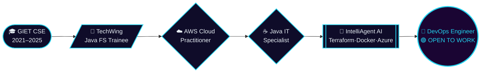

<!-- ============================================================ -->
<!--  SAI KRISHNA KASIMALLA — GITHUB PROFILE README  v4.0 PRO    -->
<!-- ============================================================ -->

<div align="center">


</div>

<div align="center">


</div>

<br>

<div align="center">

[](https://linkedin.com/in/sai-krishna-kasimalla-126b67252)
&nbsp;
[](https://leetcode.com/Sai_krishna-123)
&nbsp;
[](https://www.hackerrank.com/saikrishnakasim1)
&nbsp;
[](https://www.codechef.com/users/saikrishnak_45)
&nbsp;
[](https://auth.geeksforgeeks.org/user/saikrishna9xc3)
&nbsp;
[](mailto:saikrishnakasimalla@gmail.com)
&nbsp;


</div>

---

## `$ cat profile.yaml`

```yaml
name     : Sai Krishna Kasimalla
degree   : B.Tech CSE — GIET Rajahmundry (2025) · CGPA 8.61
location : Hyderabad, India 🇮🇳
focus    : DevOps Engineer — automate everything between code and production
secondary: Java Full Stack · Backend · Cloud Engineering
status   : 🟢 Open to full-time fresher roles — available immediately
# "If it can be scripted, it should never be manual."
```

<br>

<div align="center">

| 🎯 Actively Seeking | ☁️ AWS Certified | ☕ Java Specialist | ⚡ 500+ DSA | 🟢 Available Now |
|:---:|:---:|:---:|:---:|:---:|
| DevOps Engineer | Cloud Practitioner | Pearson / Certiport | Across 4 Platforms | Immediately |

</div>

---

## 🗺 Career Pipeline



---

## 🚀 Project Showcase

<table>
<tr>
<td width="50%" valign="top">

### 🤖 IntelliAgent AI / NeuralOps
> **`Flagship Project`**

**Terraform · Docker · GitHub Actions · Azure DevOps · Microsoft Azure**

Modular Terraform provisions Azure infra end-to-end. Docker packages the app. GitHub Actions + Azure DevOps automate **build → test → deploy → release** on every push.

**Result:** Repeatable, version-controlled infra with zero manual console clicks.

</td>
<td width="50%" valign="top">

### 🏥 AI MediSync
> **`In Progress`**

**Spring Boot Microservices · React.js · MySQL · JWT · Spring AI**

Healthcare platform with prescription OCR/AI extraction, medicine reminders, appointment management, and a Doctor Dashboard. API Gateway + Eureka Service Discovery architecture.

</td>
</tr>
<tr>
<td width="50%" valign="top">

### 🏦 Vault
> **`Full Stack`**

**Java · Spring Boot · React.js · MySQL**

Banking platform with JWT authentication, full transaction ledger, role-based access control, and a responsive React front end backed by a Spring Boot REST API.

</td>
<td width="50%" valign="top">

### 🔗 Blockchain Verification
> **`Capstone · Team Lead`**

**Blockchain · Java · React · 4-member team**

Product authenticity verification system using smart-contract logic and a React dashboard. Led end-to-end: architecture, smart contracts, and delivery.

</td>
</tr>
</table>

---

## ⚙️ Tech Stack

<div align="center">

<table>
<tr>
<td align="center"><b>🧠 Languages</b><br><br>

</td>
<td align="center"><b>☁️ Cloud & IaC</b><br><br>

</td>
<td align="center"><b>🔁 CI/CD</b><br><br>

</td>
<td align="center"><b>🧩 Full Stack</b><br><br>

</td>
<td align="center"><b>📊 Data & Ops</b><br><br>

</td>
</tr>
</table>

</div>

---

## 🏆 Certifications

<div align="center">

<table>
<tr>
<td align="center" width="50%">
<br>
<b>☁️ AWS Certified Cloud Practitioner</b>
<br><sub>Amazon Web Services</sub><br>

<br><br>
</td>
<td align="center" width="50%">
<br>
<b>☕ IT Specialist: Java</b>
<br><sub>Pearson / Certiport</sub><br>

<br><br>
</td>
</tr>
</table>

</div>

---

## ⚡ Competitive Programming — 500+ Solves

<div align="center">


<br>

[](https://www.hackerrank.com/saikrishnakasim1)
&nbsp;
[](https://www.codechef.com/users/saikrishnak_45)
&nbsp;
[](https://auth.geeksforgeeks.org/user/saikrishna9xc3)

</div>

---

## 📊 GitHub Stats

<div align="center">


<br>


</div>

<details>
<summary align="center"><b>📈 Contribution Activity Graph</b></summary>
<br>

</details>

---

## 🐍 Contribution Snake

<div align="center">
<picture>
  <source media="(prefers-color-scheme: dark)" srcset="https://raw.githubusercontent.com/SaiKrishnaKasimalla-839/SaiKrishnaKasimalla-839/output/github-snake-dark.svg" />
  <source media="(prefers-color-scheme: light)" srcset="https://raw.githubusercontent.com/SaiKrishnaKasimalla-839/SaiKrishnaKasimalla-839/output/github-snake.svg" />
  
</picture>
<sub>Setup: add <code>.github/workflows/snake.yml</code> using the <code>Platane/snk</code> action</sub>
</div>

---

## 🎯 Right Now

```diff
+ Applying   : DevOps Engineer — fresher roles across India (primary)
+ Secondary  : Java Full Stack · Backend · Software Engineer
+ Building   : AI MediSync — healthcare microservices platform
+ Learning   : Kubernetes · Advanced Terraform Modules · DevSecOps
! Side Quest : Telugu YouTube series documenting the fresher job-hunt grind
# Available immediately · Full-time · Open to relocation
```

---

<div align="center">

### 🌐 Let's Connect

[](https://linkedin.com/in/sai-krishna-kasimalla-126b67252)
&nbsp;
[](mailto:saikrishnakasimalla@gmail.com)
&nbsp;
[](https://github.com/SaiKrishnaKasimalla-839)

<br>

**⚡ Open to full-time fresher roles — DevOps · Cloud · Java Full Stack**

*"Provision it. Containerize it. Automate the rest."*

<br>


</div>
